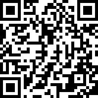
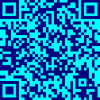
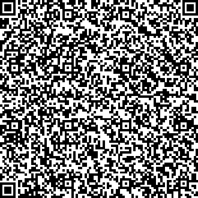
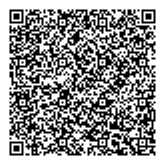

# FoxBarcodeQR 

**FoxBarcodeQR** is a supplement of **[FoxBarcode](https://github.com/VFPX/FoxBarCode)** class only for QR Code barcodes. 

**FoxBarcodeQR** uses the **BarCodeLibrary.dll** libraries *(Darío Álvarez Aranda, Mexico)*, from version 2.00 of **FoxBarcodeQR** it uses **QRCodeLib.dll** *([www.validacfd.com](http://www.validacfd.com))* adding support to encode more than 255 characters and greater control in the generation of the QR code, and as of version 2.10 it uses the **Google API** (https://developers.google.com/chart/infographics/docs/qr_codes) to generate QR codes.

You can choose by different methods which library to use.

This class is a workaround for all developers requesting QR Code support with the **FoxBarcode** class.

### Project Manager:

***Guillermo Carrero** (RIP) (Barcelona, Spain) and **Luis Maria Guayan** (Tucuman, Argentina)*

### Latest release

**[FoxBarcodeQR_v_2_10](/FoxBarcodeQR_v_2_10/)** - v.2.10 - Release 2021.02.27

### Features of external libraries

The **BarCodeLibrary.dll** library generates functionals QR Codes, but you can only set the type and size of the generated image. No settings supports for error correction level.

### The external library

**BarCodeLibrary.dll**

* It generates functional QR Codes, but can only set the size and type of generated image.
* It has no adjustments for the level of error correction, colors and / or margins.
* It does not support strings longer than 255 characters.

The BarCodeLibrary.dll library contains only 3 functions:

*  **LibraryVersion:** Returns a string with the version of the library.
*  **SetConfiguration:** A method to set the size and type of image file to generate.
*  **GenerateFile:** This method is responsible for generating the image of the QR Code.

**QRCodeLib.dll** *(recommended) (Visit: [www.validacfd.com](http://www.validacfd.com))*

* Generate functional QR codes with greater configuration control.
* Supports strings of more than 255 characters.

The BarCodeLib.dll library (version 0.1b) (Visit: [www.validacfd.com](http://www.validacfd.com)) contains the methods:

*  **QRCodeLibVer:** Returns a string with the version of the library.
*  **FastQRCode:** Generates the image of the QR Code with the text to be encoded.
*  **FullQRCode:** Same as the previous method, but with greater control in the generation of the QR Code image.

**Google API** *(Discontinued)*

* Generates QR codes through a POST call to a URL, so it requires an internet connection
* Supports strings of more than 255 characters.

**QR Server API** *Coming soon*

*This API replaces the discontinued Google API.

### FoxBarcodeQR class methods

**FoxBarcodeQR** encapsulates the functions of the **BarCodeLibrary.dll**, **QRCodeLib.dll** and **Google API** libraries in the class's own methods for compatibility with previous versions and to be able to select the library to use..

The methods of the **FoxBarcodeQR** class are:

**QRBarcodeImage()** that uses the BarCodeLibrary.dll library and receives the following parameters:

* **tcText:** Text to encode
* **tcFile:** Name the image file to generate. If none is specified, it generates a random file name in the Windows temporary files folder.
* **tnSize:** The size of the generated image. Receives an integer between 2 and 12
  * 2 = 66 x 66 (in pixels)
  * 3 = 99 x 99
  * 4 = 132 x 132
  * 5 = 165 x 165
  * 6 = 198 x 198
  * 7 = 231 x 231
  * 8 = 264 x 264
  * 9 = 297 x 297
  * 10 = 330 x 330
  * 11 = 363 x 363
  * 12 = 396 x 396
  
* **tnType:** The type of the generated image file. Receives an integer between 0 and 2.
  * 0 = BMP
  * 1 = JPG
  * 2 = PNG

As of **FoxBarcodeQR** version 2.0, the new added methods use the QRCodeLib.dll library:

**FullQRCodeImage()** that receives the same parameters as **QRBarcodeImage()**
* **tcText:** Text to encode
* **tcFile:** Name the image file to generate. If none is specified, it generates a random file name in the Windows temporary files folder.
* **tnSize:** The width and height in pixels of the generated image
* **tnType:** (only for compatibility) The library only generates image file type 0 = BMP

The following properties are used to configure the other options:

* **lAutoConfigure:** .T. to select a larger QR code version if the amount of data requires it.
* **lAutoFit:** Works in conjunction with lAutoConfigurate
* **nBackColor:** Color of the QR code background
* **nBarColor:** Color of the QR code bars
* **nCorrectionLevel:** Error correction level:
  * 0 = Level L (7%)
  * 1 = Level M (15%)
  * 2 = Level Q (25%)
  * 3 = Level H (30%)
* **nEncoding:** Encoding algorithm:
  * 0 = Alphabetic: Encodes alphanumeric characters (digits 0-9; uppercase A-Z; other nine characters: Space $% * + -. /:)
  * 1 = Byte = 1: Encode binary values (8-bit data)
  * 2 = Numeric: Encodes only numeric values (digits 0-9)
  * 3 = Kanji: Encodes Kanji characters. Kanji characters in QR Code can have values 8140-9FFC and E040-EBBF
  * 4 = Auto: Automatic selection of the encoding algorithm. (Recommended)
* **nMarginPixels:** Margin in pixels
* **nModuleWidth:** Size of modules in pixels
* **nHeight:** Image height in pixels
* **nWidth:** Image width in pixels

**FastQRCodeImage()** is the same as the **FullQRCodeImage()** method and only the text to be encoded is passed. The rest are configured automatically, without any user control.
* **tcText:** Text to encode
* **tcFile:** Name of the image file you want to generate. If none is specified, a random file name is generated in the Windows temporary files folder.

As of version 2.10 of **FoxBarcodeQR** a new method was added that uses the **Google API**:

**GooQRCodeImage()** receives the same parameters as the previous methods to standardize the class:
* **tcText:** Text to encode
* **tcFile:** Name of the image file you want to generate. If none is specified, a random file name is generated in the Windows temporary files folder.
* **tnSize:** The width and height in pixels of the generated image
* **tnType:** (for compatibility only) API only generates image file type 2 = PNG

This API allows us to adjust some other properties such as:

* **nCorrectionLevel:** Error correction level:
  * 0 = Level L (7%)
  * 1 = Level M (15%)
  * 2 = Level Q (25%)
  * 3 = Level H (30%)
* **nMarginPixels:** Margin in columns

**SvrQRCodeImage()** *Coming soon*
* **tcText:** Text to encode
* **tcFile:** Name of the image file you want to generate. If none is specified, a random file name is generated in the Windows temporary files folder.
* **tnSize:** The width and height in pixels of the generated image
* **tnType:** Possible values: png, gif, jpeg, jpg, svg, eps

All these methods return the path and file name of the image generated with the QR Code.

### Examples

In the following example, two QR Code images are created, the first with the **QRBarcodeImage()** method and the second with the **FullQRCodeImage()** method:

<pre>SET PROCEDURE TO LOCFILE("FoxBarcodeQR.prg") ADITIVE
*--- Create a FoxBarcodeQR object
LOCAL loFbc, lcQRImage
loFbc = CREATEOBJECT("FoxBarcodeQR")

*-- Using the BarCodeLibrary.dll library
lcQRImage1 = loFbc.QRBarcodeImage("https://github.com/VFPX/FoxBarcodeQR",,6,0)

*-- Using the QRCodeLib.dll library (Visit: www.validacfd.com)
loFbc.nBackColor = RGB(0,255,255) && Yelow
loFbc.nBarColor = RGB(0,0,128) && Blue
loFbc.nCorrectionLevel = 2 && Q 25%
lcQRImage2 = loFbc.FullQRCodeImage("https://github.com/VFPX/FoxBarcodeQR",,198,0)</pre>

    

As of this new version 2.00 of **FoxBarcodeQR**, strings of characters greater than 255 characters can be encoded with the **QRCodeLib.dll** library and the **Google API**. Example:

<pre>SET PROCEDURE TO LOCFILE("FoxBarcodeQR.prg") ADITIVE
*--- Create a FoxBarcodeQR object
LOCAL loFbc, lcQRImage
loFbc = CREATEOBJECT("FoxBarcodeQR")

lcString = "+ .0010. -"
DO WHILE LEN(lcString) < 500
  lnI = LEN(lcString) + 10
  lcString = lcString + "+ ." + TRANSFORM(lnI, "@L 9999") + ". -"
ENDDO

*-- Using the QRCodeLib.dll library (Visit: www.validacfd.com)
lcQRImage = loFbc.FullQRCodeImage(lcString,,330)

*-- Using the Google API
lcQRImage = loFbc.GooQRCodeImage(lcString,,330)
</pre>

   

To include a barcode on a report, you must insert an Image object and set the property with a call ControlSource **QRBarcodeImage()** method and is recommended to set "contents Scale, Retain shape" if the image size differs from the frame.

**Important:** Before you run the report and create the object FoxBarcode, you must declare the variable as **PRIVATE** so that it has scope in the report, as follows:

<pre>*--- Create FoxBarcodeQR private object
PRIVATE poFbc
m.poFbc = CREATEOBJECT("FoxBarcodeQR")
...
REPORT FORM FoxBarcodeQR PREVIEW</pre>

### Distribution

The only files needed to be distributed to FoxBarcodeQR function properly are:

*  FoxBarcodeQR.prg
*  BarCodeLibrary.dll
*  QRCodeLib.dll (Visit: [www.validacfd.com](http://www.validacfd.com))
 
***Notes on the distribution and installation of the BarCodeLibrary.dll and QRCodeLib.dll files:***

The **BarCodeLibrary.dll** and **QRCodeLib.dll** files are not registered. They should both be in the same application folder or in the Windows System folder.

**BarCodeLibrary.dll** and **QRCodeLib.dll** were tested and work on Windows XP, 7, 8 and 10 (32 and 64 bit)

### Acknowledgements

* To my friend **Guillermo** who enlightens me from heaven to make this complement for our **FoxBarcode** class.
* To [www.validacfd.com](http://www.validacfd.com) for your library QRCodeLib.dll.

### What's New?

**v.2.25 - Release soon**
* Use QR Server API (requires internet connection)
* This API replaces the discontinued Google API.
* This new API support:
  * Encoding of more than 255 characters.
  * Level of error correction recovery.
  * Image type: png, gif, jpeg, jpg, vector graphics svg and eps 
  * For more complete and detailed information, read the documentation for this API library at: [goqr.me/api/doc/create-qr-code/](https://goqr.me/api/doc/create-qr-code/)
    
**v.2.21 - Release 2021.01.04**
* Updated version QRCodeLib.dll v.1.2.130915 Demo (visit: www.validacfd.com)
* Now supports setting the version of QR Code (1..40)
  
**v.2.10 - Release 2021.02.27**
* Use Google API (requires internet connection)
* This API only support PNG image type

**v.2.00 - Release 2020.11.07**
* Change external dll library QRCodeLib.dll (Visit: [www.validacfd.com](http://www.validacfd.com))
* Now supports encoding of more than 255 characters.
* Now supports set the background color and color of the bar.
* Now supports setting the level of error correction recovery:
  * Level L (Low): 7% of codewords can be restored.
  * Level M (Medium): 15% of codewords can be restored.
  * Level Q (Quartile): 25% of codewords can be restored.
  * Level H (High): 30% of codewords can be restored.
* Now supports the selection of the coding algorithm:
  * Numeric: encodes numeric values only (digits 0-9) 
  * Alphanumeric: encodes alphanumeric characters (digits 0-9; upper case letters A-Z; nine other characters: Space $ % * + – . / : ) 
  * Binary/byte: encodes binary values (8-bit data) 
  * Kanji/kana: encodes Kanji characters. Kanji characters in QR Code can have values 8140-9FFC and E040-EBBF
  * Auto: automatic seleccion of the encoding algorithm
* Only support BMP image type

**v.1.17 - Release 2016.12.21**
* Version number matched to FoxBarcode an New Year !
* Fixed some minor bugs

**v.1.11 - Release 2013.08.24**
* New property lDeleteTempFiles: Lets choose if delete or not the temporary folder and image files
* Version number matched to FoxBarcode
* Fixed some minor bugs

**v.1.00 - Release 2013.02.16**
* Barcode Symbologies: QR code
* Image types: BMP, JPG and PNG
* External dll library: BarCodeLibrary.dll

