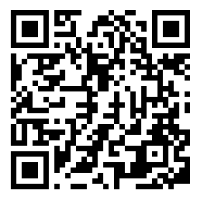
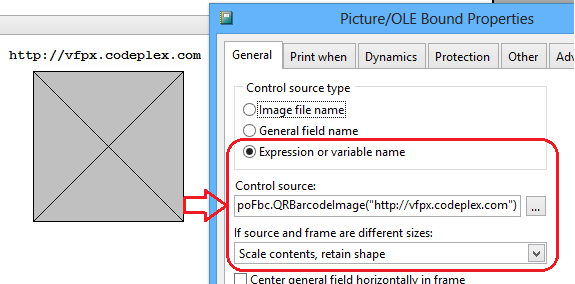

# FoxBarcodeQR 

**FoxBarcodeQR** is a supplement of **[FoxBarcode](https://github.com/VFPX/FoxBarCode)** class only for QR Code barcodes. This class is an alternative solution for all developers who requested QR Code support.

**FoxBarcodeQR** use the free library **BarCodeLibrary.DLL** of ***Dario Alvarez Aranda** (Mexico)*

### Project Manager:

***Guillermo Carrero** (RIP) (Barcelona, Spain) and **Luis Maria Guayan** (Tucuman, Argentina)*

### Latest release

**[FoxBarcodeQR_v_1_17](/FoxBarcodeQR_v_1_17/)** - v.1.17 - Release 2016.12.21

### Features

The **BarCodeLibrary.DLL** library generates functionals QR Codes, but you can only set the type and size of the generated image. No settings supports for error correction level.

### The external library

The **BarCodeLibrary.DLL** library, only have three functions to declare:

*  **LibraryVersion:** Returns a string with the version of the library.
*  **SetConfiguration:** A method to set the size and type of image file to generate.
*  **GenerateFile:** This method is responsible for generating the image of the QR Code.

### Methods

**FoxBarcodeQR** encapsulates **BarCodeLibrary.dll** library functions into a single method called **QRBarcodeImage()**, which receives the following parameters:

* **tcText:** Text to encode
* **tcFile:** Name the image file to generate. If none is specified, it generates a random file name in the Windows temporary files folder.
* **tnSize:** The size of the generated image. Receives an integer between 2 and 12
  * 2 = 66 x 66 (in pixels)
  * 3 = 99 x 99
  * 4 = 132 x 132
  * 5 = 165 x 165
  * 6 = 198 x 198
  * 7 = 231 x 231
  * 8 = 264 x 264
  * 9 = 297 x 297
  * 10 = 330 x 330
  * 11 = 363 x 363
  * 12 = 396 x 396
  
* **tnType:** The type of the generated image file. Receives an integer between 0 and 2.
  * 0 = BMP
  * 1 = JPG
  * 2 = PNG

And returns the file path of the bar code image generated.

### Examples

The following example creates a image of a QR Code barcode from a size 6 (198 x 198 pixels) and PNG type.

<pre>SET PROCEDURE TO LOCFILE("FoxBarcodeQR.prg") ADDITIVE

*--- Create FoxBarcodeQR object and QR Code barcode image<
LOCAL loFbc, lcQRImage
loFbc = CREATEOBJECT("FoxBarcodeQR")
lcQRImage = loFbc.QRBarcodeImage("https://github.com/VFPX/FoxBarCodeQR",,6,2)</pre>

To include a barcode on a report, you must insert an Image object and set the property with a call ControlSource **QRBarcodeImage()** method and is recommended to set "contents Scale, Retain shape" if the image size differs from the frame.

**Important:** Before you run the report and create the object FoxBarcode, you must declare the variable as **PRIVATE** so that it has scope in the report, as follows:

<pre>*--- Create FoxBarcodeQR private object
PRIVATE poFbc
m.poFbc = CREATEOBJECT("FoxBarcodeQR")
...
REPORT FORM FoxBarcodeQR PREVIEW</pre>

### Distribution

The only files needed to be distributed to FoxBarcodeQR function properly are:

*  FoxBarcodeQR.prg
*  BarCodeLibrary.dll
 
Notes on the distribution, installation and limitation of BarCodeLibrary.dll file:

  * **BarCodeLibrary.dll** file not register. It must be in the same folder as the application or in the Windows System folder.
  * **BarCodeLibrary.dll** was tested and runs on Windows XP, 7, 8 and 10 (32 and 64 bits)
  * **BarCodeLibrary.dll** has the limitation of encoding only up to 255 characters, so **FoxBarcodeQR** also has this limitation.

### Acknowledgements

To my friend **Guillermo** from heaven illuminated me with this supplement to our class **FoxBarcode**.

### What's New?

**v.1.17 - Release 2016.12.21**
* Version number matched to FoxBarcode an New Year !
* Fixed some minor bugs

**v.1.11 - Release 2013.08.24**
* New property lDeleteTempFiles: Lets choose if delete or not the temporary folder and image files
* Version number matched to FoxBarcode
* Fixed some minor bugs

**v.1.00 - Release 2013.02.16**
* Barcode Symbologies: QR code
* Image types: BMP, JPG and PNG
* External DLL library: BarCodeLibrary.dll

